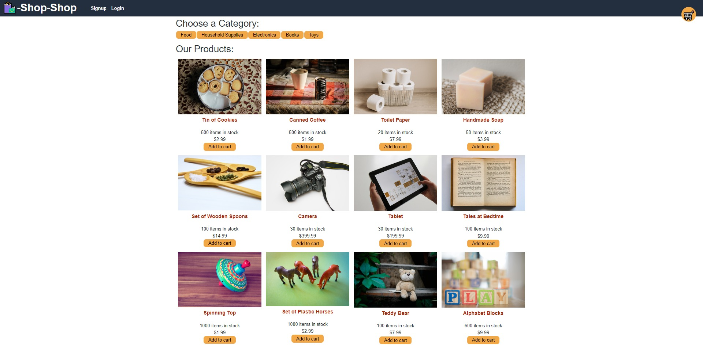

# Module 22 redux shop challenge

## Description

This is Adrian Jimenez's module 22 extra credit redux shop challenge submission. 

This project is a refactor of the global state used in this week's "shoppe-shop" project. the project refactors the global state to be provided by redux instead of using built in react features. All features remain the same, and the app is still functional as before.

## Table of Contents

- [Installation](#installation)
- [Languages](#languages)
- [Usage](#usage)
- [Credits](#credits)
- [License](#license)
- [Contributing](#contributing)
- [Questions](#questions)

## Installation

In order to install this project, download all files and have node.js installed on your machine. Navigate to the root directory and type: 

    npm install

Once all dependencies have been downloaded, you can start the react development server by typing npm run develop or start the application by typing npm start

## Technologies Used

* JavaScript
* Node.JS
* React
* CSS
* HTML
* ApolloServer
* GraphQL
* react-router-dom
* Express
* MongoDB
* Redux

## Usage

In order to use this project, please make sure you have node.js intalled on your machine. Once that is set up, simply execute npm start and the application should start. Alternatively, visit the site [here](https://sleepy-scrubland-92397.herokuapp.com/)

## Credits

* Adrian Jimenez

## License

This project is licensed under the MIT License. See [LICENSE.md](./LICENSE.md) for more details.

---

## Contributing

This project follows the contributor covenant contribution guidelines. See [here](https://www.contributor-covenant.org/version/2/1/code_of_conduct/) 

## Questions

If you have any questions or concerns visit my [github](https://github.com/PuppetAJ) or send me an email at <adrianjimenez1950@gmail.com>. 

